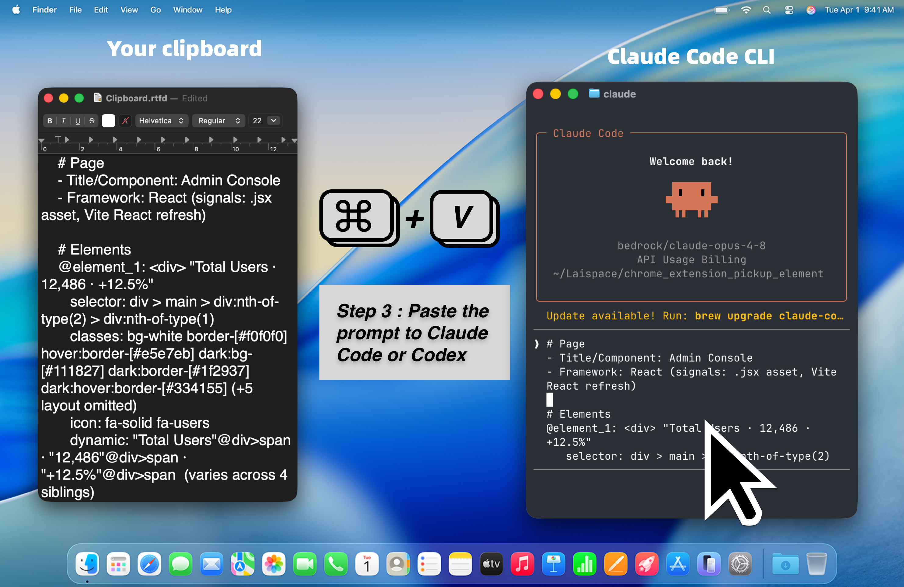

  

**Language:** English | [简体中文](README.zh-CN.md) | [繁體中文](README.zh-TW.md) | [日本語](README.ja.md) | [한국어](README.ko.md)

Prompt Picker is a Chrome extension that helps product managers and engineers turn the parts of a page that need changes into clear, actionable AI coding prompts.

Instead of describing a UI change with vague words like "the button on the right side of the card", you can click the exact element on the page, add your change request, and copy a structured prompt for Claude Code, Codex, Cursor, or another AI coding agent.

<a href="https://chromewebstore.google.com/detail/prompt-picker/lgcmgmlbomeodhmikhiphmonogmfdeeg"> Install Prompt Picker from the Chrome Web Store</a>

## ✨ What It Does

Prompt Picker lets you:

1. Select the elements that need changes: select target elements directly on the page and describe what you want to change.
2. Automatically generate a contextual Prompt: generate an AI Prompt with Selector, DOM structure, component information, and page context.
3. Improve AI change success rate: help AI Agents quickly find the corresponding code, reduce back-and-forth, and improve change accuracy.

## 👥 Who It Is For

| Role | How Prompt Picker Helps |
| --- | --- |
| Product managers | Explain UI changes, interaction issues, or product suggestions clearly by selecting the exact page location. |
| Engineers | Give AI coding tools precise context so they understand which element needs to change and where to search in the codebase. |

## 💡 Common Use Cases

- File a product feedback issue with exact UI context.
- Ask an AI coding agent to update a selected button, card, menu, form, or section.
- Collect UI change requests during product reviews.
- Turn "this part feels wrong" into a more actionable prompt.
- Work across multiple pages when a task involves a flow, not just one screen.

## 🧭 How To Use

1. Install Prompt Picker from the Chrome Web Store.
2. Open the web page you want to review.
3. Click the Prompt Picker extension icon, or use the shortcut: `Option + Q` on Mac, `Alt + Q` on Windows.
4. Click an element, or drag to select multiple elements.
5. Add your instruction.
6. Click **Pick & Copy**.
7. Paste the copied prompt into your AI coding tool.

## 🎯 Why It Helps

AI coding tools work better when they receive precise context. Prompt Picker gives them:

- The selected element.
- Helpful DOM and selector information.
- Nearby text and structure.
- Your requested change.

This reduces back-and-forth between product and engineering, and helps AI agents make more targeted code changes.

## 🔒 Privacy

Prompt Picker runs in your browser. It is designed to collect selected page context and copy it to your clipboard so you can decide where to paste it.

## 🚀 Install

<a href="https://chromewebstore.google.com/detail/prompt-picker/lgcmgmlbomeodhmikhiphmonogmfdeeg"> Install Prompt Picker from the Chrome Web Store</a>
