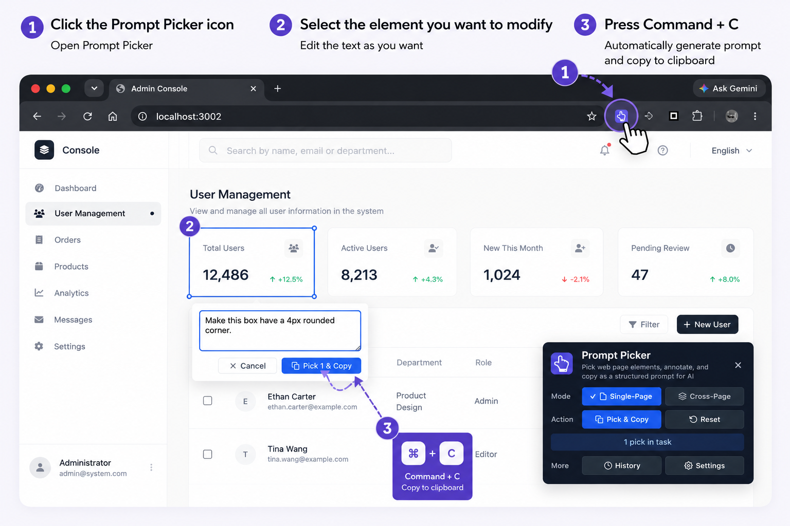
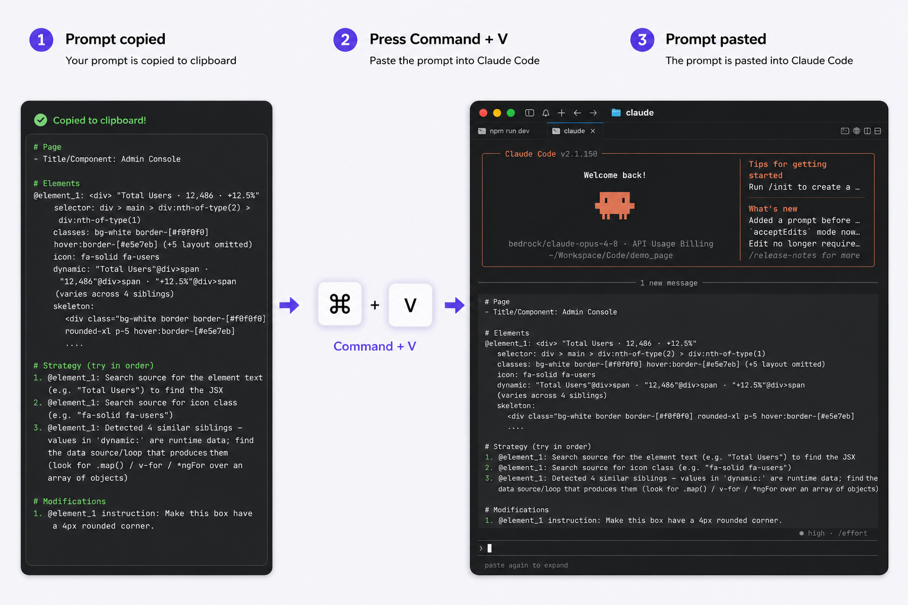

# Prompt Picker

**语言：** [English](README.md) | 简体中文 | [繁體中文](README.zh-TW.md) | [日本語](README.ja.md) | [한국어](README.ko.md)

Prompt Picker 是一个 Chrome 扩展，帮助产品经理和研发工程师把页面上所需要修改的内容，变成清晰、可执行的 AI 编程提示词。

你不需要再说“右边卡片里的那个按钮”这种模糊描述。用 Prompt Picker 直接点选页面元素，写下修改说明，然后复制一段结构化 prompt，粘贴给 Claude Code、Codex、Cursor 或其他 AI 编程工具。

[从 Chrome Web Store 安装 Prompt Picker](https://chromewebstore.google.com/detail/prompt-picker/lgcmgmlbomeodhmikhiphmonogmfdeeg)

## 它能做什么

Prompt Picker 可以帮助你：

1. 选择需要修改的元素：在页面中直接选中目标元素，并描述你的修改需求。
2. 自动生成上下文 Prompt：生成包含 Selector、DOM 结构、组件信息和页面上下文的 AI Prompt。
3. 提升 AI 修改成功率：帮助 AI Agent 快速找到对应代码，减少反复沟通，提高修改准确率。

## 适合谁使用

**产品经理**

当你想描述 UI 修改、交互问题或产品建议时，可以直接点选页面中的具体位置，让反馈更清楚。

**研发工程师**

当你希望 AI 编程工具理解“到底要改哪个元素”时，可以用 Prompt Picker 生成更准确的上下文。

## 常见场景

- 创建带有明确 UI 上下文的产品反馈 issue。
- 让 AI Agent 修改某个按钮、卡片、菜单、表单或页面区块。
- 在产品评审时快速记录修改意见。
- 把“这里感觉不对”变成更可执行的任务描述。
- 跨多个页面收集同一个流程里的修改点。

## 使用方法

1. 从 Chrome Web Store 安装 Prompt Picker。
2. 打开你要评审的网页。
3. 点击浏览器工具栏里的 Prompt Picker 图标，或使用快捷键：Mac 使用 `Option + Q`，Windows 使用 `Alt + Q`。
4. 点击元素，或拖拽框选多个元素。
5. 写下你的修改说明。
6. 点击 **Pick & Copy**。
7. 把复制出来的 prompt 粘贴到 AI 编程工具里。

## 为什么有用

AI 编程工具拿到的上下文越准确，越容易改对地方。Prompt Picker 会把这些信息整理进 prompt：

- 你选中的页面元素。
- 有用的 DOM 和 selector 信息。
- 附近文本和结构。
- 你的修改说明。

这样可以减少产品和研发之间的反复沟通，也能让 AI Agent 更有针对性地修改代码。

## 隐私说明

Prompt Picker 在浏览器内运行。它会收集你选中的页面上下文，并复制到剪贴板，由你决定粘贴到哪里。

## 安装

[从 Chrome Web Store 安装 Prompt Picker](https://chromewebstore.google.com/detail/prompt-picker/lgcmgmlbomeodhmikhiphmonogmfdeeg)
